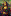

# CS 480/580 - Assignment_2 - Dániel B. Papp

# How to run

```console
python3 app.py
```

# How it works

I opted into using Deap and PIL libraries in order to create the generic image-evolution algorithm (refereed to as gia in the code). After setting up our GIA class, which takes one parameter being the image's path that is our goal state. In my case this path is `/assets/mona_lisa_xs.png`.

We create a new instance of the GIA class and pass in the path, then call the run method which is stored in the `output_pixels` variable.

```python
gia = GeneticImageAlgorithm(image_name="assets/mona_lisa_xs.png")
output_pixels = gia.run()
```

Our fitness method takes one argument and works in the following way. We extract the current x and y pixels from the "buffer pixel" which we refresh on every loop iteration. We extract our target pixel's RGB values using the pix built in method, and extract the individual RGB values to compare against. Then we create the fitness variable which holds the sum of the absolute values of the difference between each RBG pixel.

```python
def __get_fitness(self, individual):
    current_x, current_y = self.current_pixel

    tr, tg, tb = self.pix[current_x, current_y]
    ir, ig, ib = tuple(individual)

    fitness = abs(tr - ir) + abs(tg - ig) + abs(tb - ib)
    return fitness,
```

The `__get_fitness` method is called in the `run` method and returns the fitness value.

Most of the tweaks that impact the outcome of the algorithm are passed into the `eaSimple` method which comes for the `deap.algorithms` class. Some of our settings also come from the `deap.Toolbox` class. Most notably the individual population size, which in our case is set to 1000, and the hall of fame size, which is set to 1.

```python
pop = self.toolbox.population(n=1000)
hof = tools.HallOfFame(maxsize=1)
```

As an example below, we set the mutation rate to 0.5, the crossover rate to 0.5, and the number of generations to 1000.

```python
algorithms.eaSimple(
    population=pop,
    toolbox=self.toolbox,
    cxpb=0.5,
    mutpb=0.5,
    ngen=1000,
    stats=stats,
    halloffame=hof,
    verbose=True
)
```

# Analysis

We can clearly identify that increasing the population size and nothing else, increases the time it takes to complete the algorithm. While increasing the generation count increases the time it takes to complete the algorithm, it not nearly as big of a difference as if we increase the population size. Changing the mutation rate and crossover rate does not seem to have a big impact on the time it takes to complete the algorithm.

## Cases

_All of the below cases were done using the `/assets/mona_lisa_xs.png` picture._

1. Where population = 10

   |          | Prob of mating | Prob of mutating | Population | Time      |
   | -------- | -------------- | ---------------- | ---------- | --------- |
   | Gen 10   | 0.5            | 0.5              | 10         | 0.45 sec  |
   | Gen 100  | 0.5            | 0.5              | 10         | 3.71 sec  |
   | Gen 1000 | 0.5            | 0.5              | 10         | 33.26 sec |

2. Where population = 100

   |          | Prob of mating | Prob of mutating | Population | Time       |
   | -------- | -------------- | ---------------- | ---------- | ---------- |
   | Gen 10   | 0.5            | 0.5              | 100        | 3.52 sec   |
   | Gen 100  | 0.5            | 0.5              | 100        | 28.60 sec  |
   | Gen 1000 | 0.5            | 0.5              | 100        | 292.28 sec |

3. Where population = 1000

   |          | Prob of mating | Prob of mutating | Population | Time        |
   | -------- | -------------- | ---------------- | ---------- | ----------- |
   | Gen 10   | 0.5            | 0.5              | 1000       | 32.56 sec   |
   | Gen 100  | 0.5            | 0.5              | 1000       | 309.95 sec  |
   | Gen 1000 | 0.5            | 0.5              | 1000       | 3134.43 sec |

## Visualization

Below we can see the comparisons between the output of the different cases where the generation is constant and the only variable is the population size. When comparing these results we can clearly see that with the increased generation count, the quality of the outputted image is increasing.

### 10 generations for population 10 / 100 / 1000 respectively. Base image on the far left.





---

### 100 generations for population 10 / 100 / 1000 respectively. Base image on the far left.


---

### 1000 generations for population 10 / 100 / 1000 respectively. Base image on the far left.


## Bonus

As a bonus test I decided to evolve the `assets/mona_lisa_small.png` image which has a dimensions of `67 x 100` px instead of the `11 x 16` px dimensions of the `assets/mona_lisa_xs.png` image. I used a _1000 generation_, _1000 population_, _0.2 mutation probability_ and _0.5 mating probability_ setting to achieve this result. The end product of the evolution is shown below. To the left is the image we inputted and on the right we can see the evolved image. The time it took to complete this evolution is was `~160,000 seconds`.


